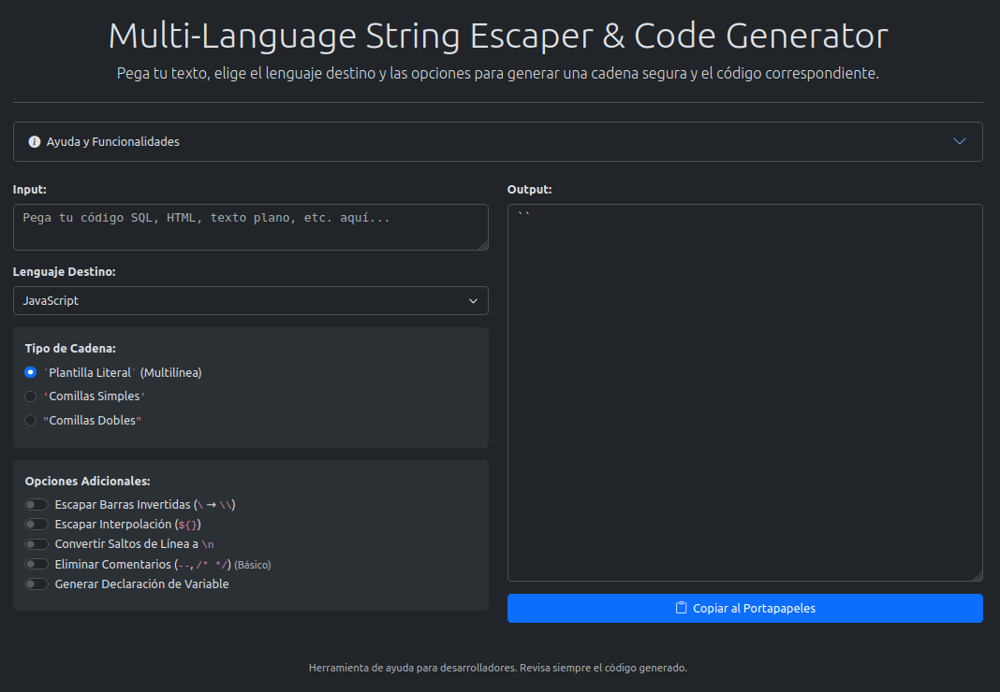

# Multi-Language String Escaper & Code Generator

[](https://opensource.org/licenses/MIT) [](https://soyunomas.github.io/multi-language-string-escaper/index.html)

Una herramienta web sencilla y eficiente para escapar cadenas de texto para múltiples lenguajes de programación (JS, Bash, Python, PHP) y generar código listo para usar, directamente en tu navegador. 🛠️

## 📝 Descripción Breve

Este proyecto ofrece una interfaz interactiva para pegar cualquier texto (código, texto plano, etc.) y convertirlo en una cadena de texto correctamente escapada para diferentes lenguajes de programación. Selecciona el lenguaje destino, el tipo de comillas y opciones adicionales (como escapar barras invertidas, manejar saltos de línea, eliminar comentarios o generar una declaración de variable) para obtener el resultado deseado. Todo el procesamiento se realiza localmente en tu navegador, asegurando privacidad y rapidez.

## 🖼️ Captura de Pantalla / Demo



Puedes probar la demo en vivo aquí:

*   **[Demo - Probar Escaper](https://soyunomas.github.io/multi-language-string-escaper/index.html)**

## ✨ Características Principales

*   **⌨️ Input Flexible:** Pega cualquier tipo de texto en el área de entrada.
*   **🌐 Multi-Lenguaje:** Soporte para escapar cadenas para:
    *   JavaScript (JS)
    *   Bash
    *   Python
    *   PHP
*   **🎯 Selección de Tipo de Cadena:** Elige el delimitador de cadena apropiado para el lenguaje seleccionado (ej. ``, `'`, `"`, `$''`, `"""`). Las opciones se adaptan dinámicamente.
*   **⚙️ Opciones de Escape Configurables:**
    *   Escapar Barras Invertidas (`\` -> `\\`).
    *   Escapar Interpolación/Variables (ej. `${}` -> `\${}`, `$` -> `\$` según el contexto).
    *   Convertir Saltos de Línea a `\n`.
    *   Eliminar Comentarios (básico para `--` y `/* */`).
    *   Generar Declaración de Variable completa.
*   **✏️ Nombre de Variable Personalizado:** Especifica el nombre de la variable cuando se genera la declaración.
*   **🖥️ Output Claro:** Muestra la cadena escapada y/o el código generado en un área de texto de solo lectura.
*   **📋 Copiado Fácil:** Botón para copiar el resultado al portapapeles con un solo clic.
*   **ℹ️ Ayuda Integrada:** Sección de ayuda desplegable (acordeón) explicando las funcionalidades.
*   **📱 Diseño Responsivo:** Interfaz adaptable basada en Bootstrap 5, funciona bien en escritorio y móviles.
*   **🎨 Tema Claro/Oscuro:** Cambia entre modos de visualización para mayor comodidad (persiste la preferencia).
*   **🔒 Orientado a la Privacidad:** Ningún texto se envía a servidores externos. Todo ocurre en el navegador.
*   **🧩 Código Autónomo:** Todo empaquetado en un único archivo HTML para simplicidad y portabilidad.

## 🛠️ Tecnologías Utilizadas

*   **HTML5:** Estructura semántica del contenido.
*   **CSS3:** Estilos personalizados para áreas de texto, tema claro/oscuro, etc.
*   **Bootstrap 5.3.x:** Framework CSS/JS para layout responsivo, componentes (botones, formularios, acordeón, selects) y utilidades.
*   **Bootstrap Icons:** Iconografía utilizada en la interfaz (copiar, información, tema, etc.).
*   **JavaScript (ES6+):** Lógica de la aplicación:
    *   Manipulación del DOM.
    *   Gestión de eventos (input, change, click).
    *   Expresiones Regulares (RegExp) para buscar y reemplazar/escapar caracteres.
    *   Lógica condicional para adaptar opciones por lenguaje y tipo de cadena.
    *   **`navigator.clipboard API`:** Para la funcionalidad de "Copiar al portapapeles".
    *   **`localStorage API`:** Para guardar la preferencia del tema.
*   **CDNs:** Bootstrap (CSS y JS) y Bootstrap Icons se cargan desde CDNs.

## 🚀 Instalación / Visualización Local

Este proyecto es una aplicación web estática del lado del cliente. Para ejecutarla localmente:

1.  **Clona el repositorio:**
    ```bash
    git clone https://github.com/soyunomas/multi-language-string-escaper.git
    ```
2.  **Navega al directorio del proyecto:**
    ```bash
    cd multi-language-string-escaper
    ```
3.  **Abre el archivo HTML principal:**
    *   Abre el archivo `index.html` directamente en tu navegador web preferido (Chrome, Firefox, Edge, etc.).
4.  **🌐 Conexión a Internet:** Puede ser necesaria inicialmente para cargar Bootstrap (CSS y JS) y Bootstrap Icons desde sus respectivos CDNs si no están cacheados.
5.  **(Sin Dependencias Adicionales):** No se requiere instalación de Node.js, servidores locales ni configuraciones complejas. ¡Simplemente abre el archivo HTML!

## 🕹️ Cómo Usar

1.  **Pegar Texto:** Pega el texto que deseas escapar en el área de "Input".
2.  **Seleccionar Lenguaje:** Elige el "Lenguaje Destino" en el menú desplegable (JavaScript, Bash, Python, PHP).
3.  **Seleccionar Tipo de Cadena:** Elige el tipo de comillas/delimitador deseado para ese lenguaje (las opciones cambiarán según el lenguaje).
4.  **Configurar Opciones:** Marca o desmarca las "Opciones Adicionales" según necesites:
    *   Escapar Barras Invertidas
    *   Escapar Interpolación (si está disponible y aplica)
    *   Convertir Saltos de Línea
    *   Eliminar Comentarios
    *   Generar Declaración de Variable
5.  **(Si aplica) Nombre de Variable:** Si marcaste "Generar Declaración de Variable", introduce un nombre válido en el campo que aparece.
6.  **Ver Resultado:** El texto escapado y/o el código completo aparecerá automáticamente en el área de "Output".
7.  **Copiar:** Haz clic en el botón "<i class="bi bi-clipboard"></i> Copiar al Portapapeles". El resultado se copiará y el botón cambiará brevemente para confirmar.
8.  **(Opcional) Consultar Ayuda:** Expande la sección "<i class="bi bi-info-circle-fill"></i> Ayuda y Funcionalidades" si tienes dudas sobre alguna opción.
9.  **(Opcional) Cambiar Tema:** Haz clic en el icono de luna <i class="bi bi-moon-stars-fill"></i> o sol <i class="bi bi-sun-fill"></i> en la esquina superior derecha para alternar entre el tema oscuro y claro.

## 📄 Licencia

Este proyecto está bajo la Licencia MIT.
[](https://opensource.org/licenses/MIT)

## 🧑‍💻 Contacto

Creado por **soyunomas** ([@soyunomas en GitHub](https://github.com/soyunomas))

---
